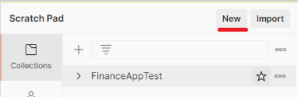
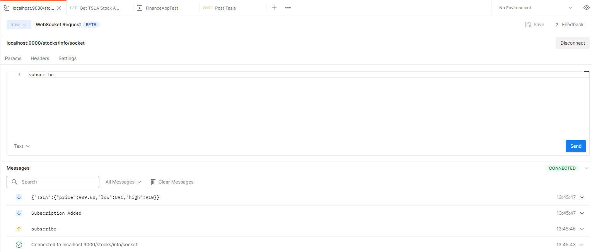

# Finance App

## Requirements

- sbt: 1.5.5
- scala: 2.13.6

## App commands

- `sbt compile` compiles the app
- `sbt run` runs the app in dev mode on localhost:9000
- `sbt test` run unit tests

### API Definition

The api definition can be found [here](conf/routes)

A more detailed description can be found [here](docs/API_Definition.md)

## Integration Tests

Integration tests are handled with postman

### Requirements

- Postman: 8.12.4

### Setup

Import the test collection into postman
from [postmanTests](postmanTests/FinanceAppTest.postman_collection.json)

### Running Tests

The current tests represent a basic user interaction with the app they can be run by clicking the
three dots next to the FinanceAppTest Collection then clicking `Run collection`

### Testing the websocket

Testing websockets as of writing is a new feature in postman and cannot be saved

- Click the new button under scratch pad

  
- Click the WebSocket Request option

  
- Enter `localhost:9000/stocks/info/socket` as the server URL and click `Connect`
- Type `subscribe` into the params field, case matters. Click send
    - If you receive `{}` post a new stock to the `/stocks` api

  
- Type `unsubscribe` to end messages

## Potential Improvements

- Add a database to maintain data between runs
- Doing integration tests with something more writeable than postman
    - Probably a typescript or js based solution, for ease of working with JSON and extensive API
      support. Also more replicates a common user profile
- Supporting multiple users
- Use Open api to generate the routes definition. This can provide a more standard definition
- Websocket updates
    - Make the socket only send updated data. Currently it sends data regardless of an update
    - Make the websocket post new stock information as soon as a new stock is added or removed
    - Make unsubscribe only unsubscribe the current websocket
- Set up a proper build process and instructions for use